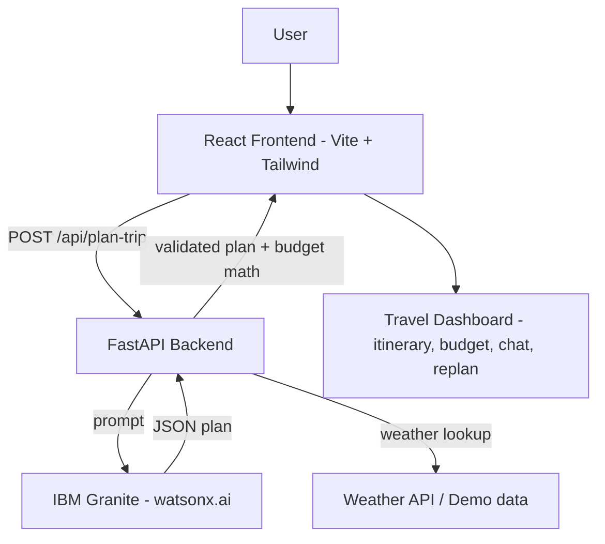

# ✈️ Travel Planner Agent

An AI-powered travel planning assistant. Tell it your destination, dates, budget and
interests, and **IBM Granite** generates a personalized day-by-day itinerary with an
estimated budget, accommodation and transport suggestions, weather information and
travel tips — all shown in a clean travel dashboard.

> **IBM Granite is the primary AI model** used by the Travel Planner Agent, accessed
> through **IBM watsonx.ai** on **IBM Cloud**. A built-in demo (mock) provider lets the
> app run without credentials for development and classroom demonstrations.

---

## Problem Statement

Planning a trip manually is time-consuming: comparing places, estimating costs, checking
weather and building a day-by-day schedule. The Travel Planner Agent solves this by
taking the user's preferences, budget and constraints and generating a complete,
personalized travel plan in seconds using AI.

## Objective

- Collect trip inputs (origin, destination, dates, travellers, budget, style, interests).
- Use **IBM Granite** to generate a personalized itinerary, tips and suggestions.
- Use plain Python for reliable calculations (day count, budget totals, validation).
- Display everything in a responsive travel dashboard with an AI assistant and a
  "modify my trip" (replan) feature.

## Features

- 🧠 **AI-Powered Planning** — IBM Granite builds the itinerary from your preferences.
- 🗺️ **Personalized Day-by-Day Itinerary** — vertical timeline with time, place and cost.
- 💰 **Budget Estimation** — itemized breakdown, progress bar, over-budget warnings and
  AI cost-saving suggestions.
- 🏨 **Accommodation Suggestions** — Budget / Standard / Premium options (estimates only,
  no booking).
- 🚄 **Transportation Suggestions** — train/flight/local options with estimated costs.
- 🌤️ **Weather Information** — live via OpenWeather when configured, otherwise clearly
  labelled *Demo Weather Data*.
- 💡 **Travel Tips** — 5–8 AI-generated tips tailored to the destination.
- 🤖 **AI Assistant Chat** — ask questions about the current trip.
- ✏️ **Modify My Trip (Replan)** — e.g. *"Make Day 3 more relaxed"* — the agent updates
  the plan.
- 🔌 **Demo Mode** — full functionality without any API keys.

## Technology Stack

| Layer | Technology |
|---|---|
| Frontend | React 18, Vite, Tailwind CSS, React Router |
| Backend | Python, FastAPI, Pydantic |
| AI | **IBM Granite** via IBM watsonx.ai |
| Cloud | **IBM Cloud** (watsonx.ai + Code Engine deployment) |
| Weather | OpenWeather API (optional, demo fallback) |
| Packaging | Docker, Docker Compose |

## Architecture



**Where Granite is used:**
1. `POST /api/plan-trip` — generates the full itinerary JSON.
2. `POST /api/chat` — answers questions about the current trip.
3. `POST /api/replan-trip` — regenerates the plan with the requested modification.
4. Cost-saving suggestions when the estimate exceeds the budget.

**Where Python is used instead of the LLM** (for reliability): day count, budget totals,
budget comparison, input validation and Pydantic response validation.

## Project Structure

```
travel-planner-agent/
├── frontend/            # React + Vite + Tailwind
│   └── src/
│       ├── components/  # Header, TripForm, BudgetCard, Itinerary, WeatherCard,
│       │                # HotelCard, TransportCard, AIChat
│       ├── pages/       # Home, PlanTrip, TripResult
│       └── services/api.js
├── backend/
│   ├── app/
│   │   ├── main.py              # FastAPI app
│   │   ├── config.py            # environment settings
│   │   ├── routes/              # trips, chat, weather
│   │   ├── ai/                  # granite_client, mock_granite, prompts
│   │   ├── services/weather_service.py
│   │   └── models/trip_models.py
│   ├── tests/                   # pytest suite (runs in demo mode)
│   └── requirements.txt
├── demo-data/sample_trip.json
├── .env.example
├── docker-compose.yml
└── README.md
```

## Getting Started

### Prerequisites

- Python 3.10+
- Node.js 18+

### 1. Backend

```bash
cd backend
python -m venv venv
# Windows:
venv\Scripts\activate
# macOS/Linux:
source venv/bin/activate

pip install -r requirements.txt
uvicorn app.main:app --reload --port 8000
```

The API is now at http://localhost:8000 (interactive docs at `/docs`).

### 2. Frontend

```bash
cd frontend
npm install
npm run dev
```

Open http://localhost:5173 and plan a trip!

### 3. Run Tests

```bash
cd backend
pytest
```

The test suite covers the health endpoint, trip planning, validation errors
(missing destination, invalid dates, negative budget), budget calculation,
chat, replanning and the mock provider. All tests pass in demo mode.

## Environment Setup

Copy `.env.example` to `.env` (backend) and fill in your keys:

```
DEMO_MODE=true
IBM_CLOUD_API_KEY=
WATSONX_PROJECT_ID=
WATSONX_URL=https://us-south.ml.cloud.ibm.com
GRANITE_MODEL_ID=ibm/granite-3-3-8b-instruct
WEATHER_API_KEY=
FRONTEND_URL=http://localhost:5173
```

Never commit `.env` — it is already in `.gitignore`.

For local runs you can also export the variables before starting uvicorn
(on Windows PowerShell: `$env:DEMO_MODE="false"` etc.).

## Demo Mode

`DEMO_MODE=true` (default) uses:
- a **mock Granite provider** that generates a realistic sample itinerary, and
- **demo weather data**, clearly labelled as such in the UI.

This guarantees the application is fully demonstrable without any credentials.
Set `DEMO_MODE=false` **and** provide IBM credentials to use real IBM Granite.
If Granite fails at runtime while demo mode is on, the app automatically falls
back to the mock provider so it never crashes during a demo.

## IBM Granite & watsonx.ai Setup

1. Create a free [IBM Cloud account](https://cloud.ibm.com/).
2. Create a **watsonx.ai** service instance (Lite plan is fine).
3. Create a **watsonx project** and note its **Project ID**.
4. Generate an **IBM Cloud API key** (Manage → Access (IAM) → API keys).
5. Set in `.env`:
   - `IBM_CLOUD_API_KEY` — your API key
   - `WATSONX_PROJECT_ID` — your project ID
   - `WATSONX_URL` — your region endpoint, e.g. `https://us-south.ml.cloud.ibm.com`
   - `GRANITE_MODEL_ID` — e.g. `ibm/granite-3-3-8b-instruct`
6. Set `DEMO_MODE=false` and restart the backend.

## IBM Cloud Deployment (Code Engine)

1. Install the IBM Cloud CLI and log in:
   ```bash
   ibmcloud login
   ibmcloud target -r us-south
   ibmcloud plugin install code-engine
   ```
2. Create a Code Engine project:
   ```bash
   ibmcloud ce project create --name travel-planner
   ibmcloud ce project select --name travel-planner
   ```
3. Deploy the backend:
   ```bash
   ibmcloud ce application create --name travel-backend \
     --src ./backend --strategy dockerfile \
     --env DEMO_MODE=false \
     --env IBM_CLOUD_API_KEY=<key> \
     --env WATSONX_PROJECT_ID=<id> \
     --env WATSONX_URL=https://us-south.ml.cloud.ibm.com \
     --env GRANITE_MODEL_ID=ibm/granite-3-3-8b-instruct \
     --port 8000
   ```
4. Deploy the frontend, pointing it at the backend URL:
   ```bash
   ibmcloud ce application create --name travel-frontend \
     --src ./frontend --strategy dockerfile \
     --build-env VITE_API_URL=https://travel-backend.<region>.codeengine.appdomain.cloud \
     --port 80
   ```
5. Open the printed frontend URL and test the deployed application.

## Docker (local)

```bash
docker compose up --build
```

Runs the backend on http://localhost:8000 and the frontend on http://localhost:5173.

## Live Demonstration Script

1. **Plan a trip** — Delhi → Goa, ₹40,000, 5 days, 2 travellers,
   Beaches + Food + Sightseeing → *Generate Travel Plan*.
   Show the summary, budget, 5-day itinerary, hotels, transport, weather and tips.
2. **AI Assistant** — ask *"Make my trip cheaper."*
3. **Modify My Trip** — enter *"Make Day 3 more relaxed."* and show the updated plan.

## Future Scope

- Real hotel / flight booking integrations
- Maps and navigation
- User accounts and saved trips
- Notifications and price alerts
- Mobile application

These are future enhancements — intentionally not part of the current project.
